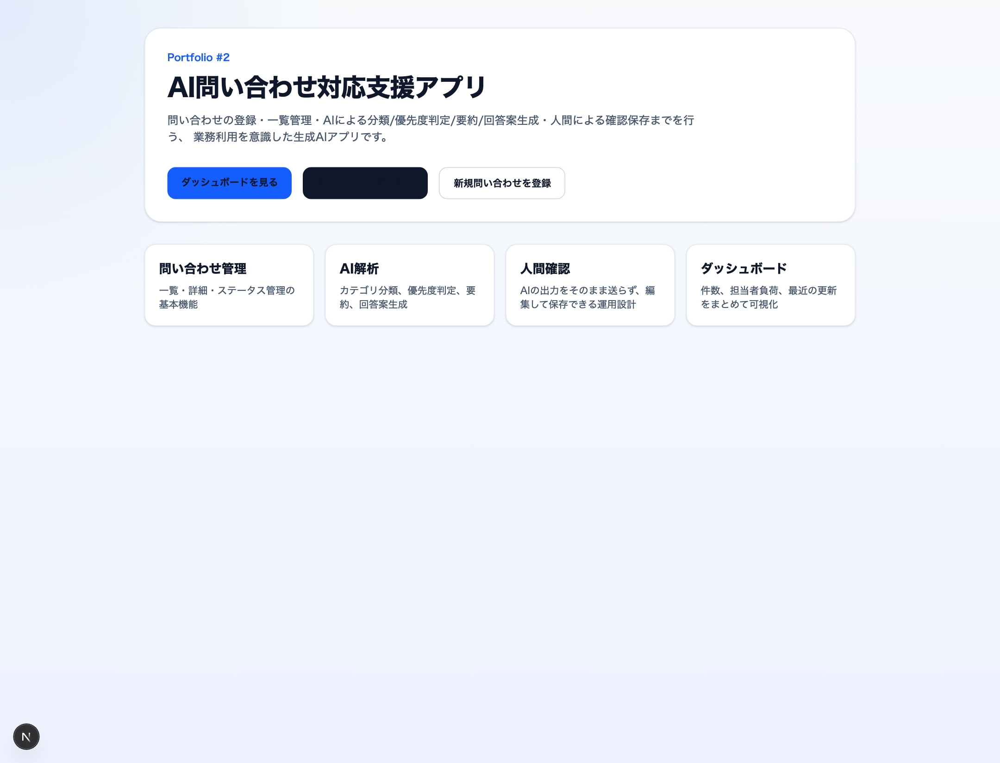
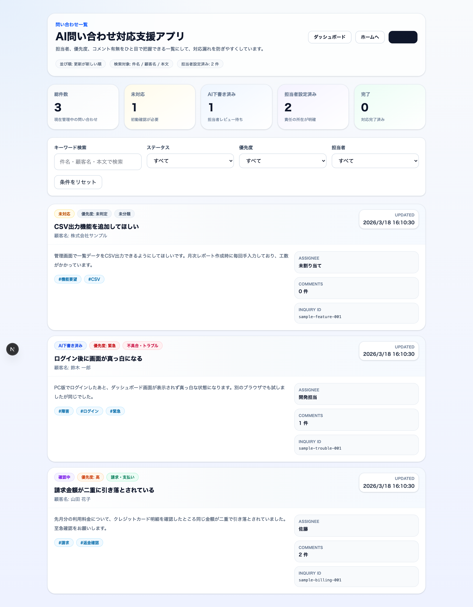
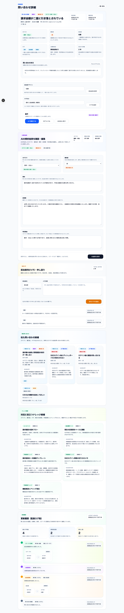
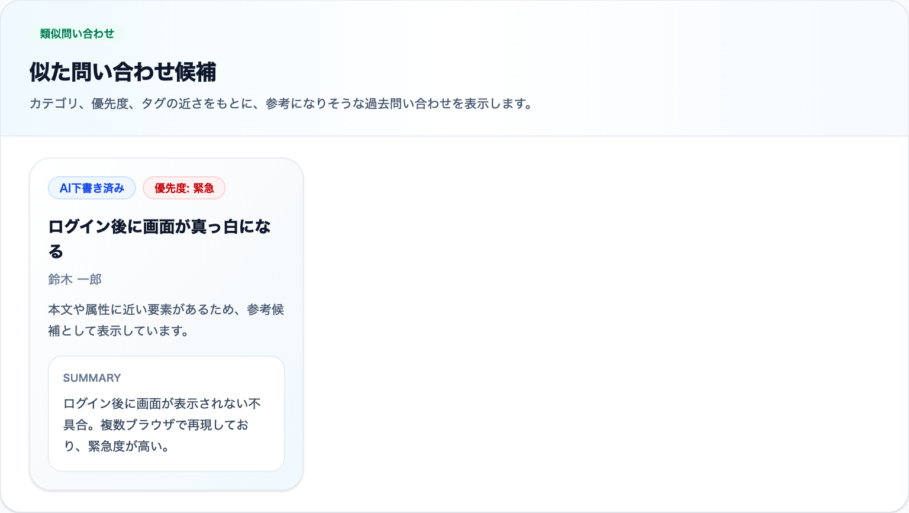
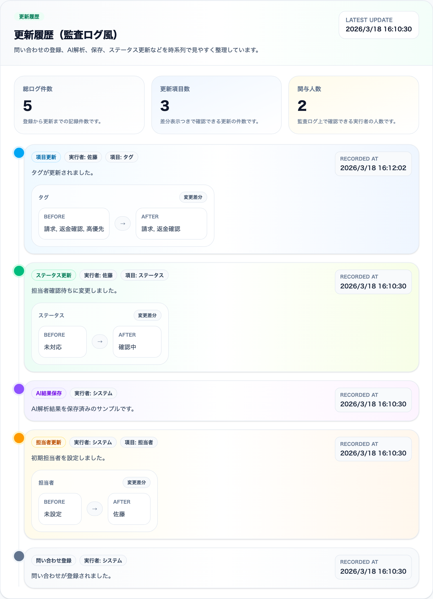
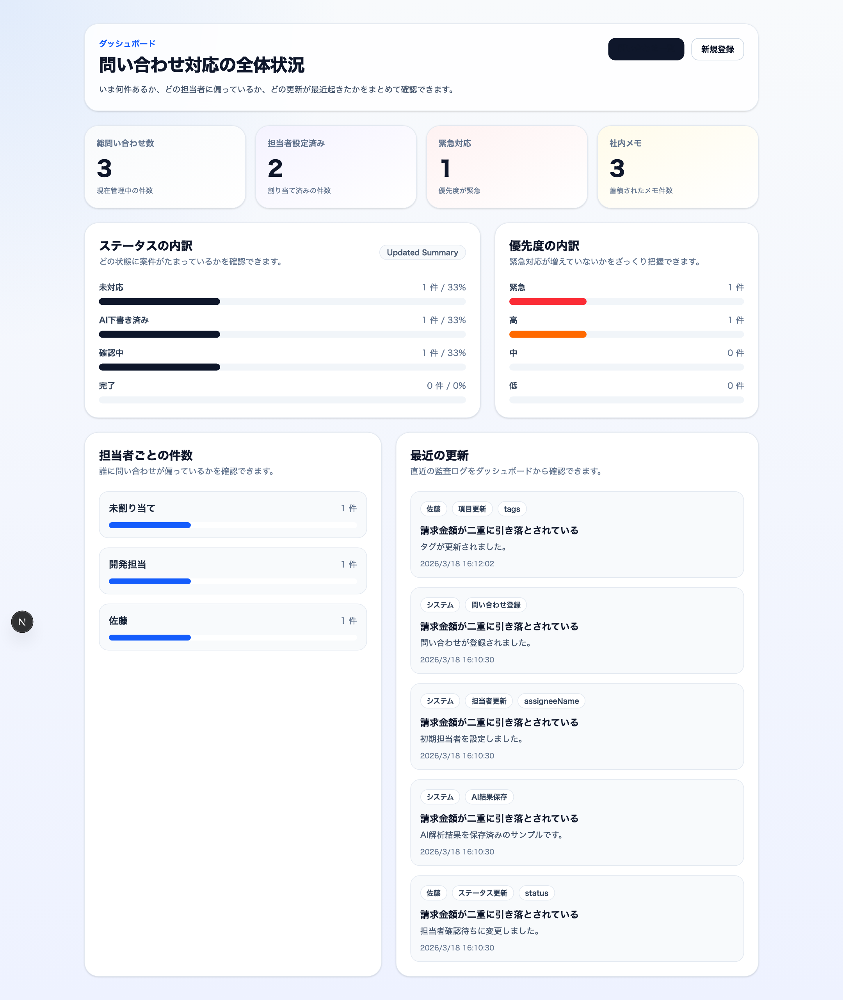

# AI問い合わせ対応支援アプリ

問い合わせの登録、一覧管理、AIによる分類と回答案生成、人による確認、担当者アサイン、監査ログ確認までを行う、業務利用を意識した生成AIアプリです。

転職用ポートフォリオとして、単なるチャット画面ではなく、生成AIを既存業務フローに組み込む設計と実装を見せることを目的に開発しました。

## URL / デモ

- Demo: `準備中`
- Repository: `https://github.com/qiaokouhezhen11-star/ai-support-workflow`

固定サンプルデータの詳細URL:

- `http://localhost:3000/inquiries/sample-billing-001`
- `http://localhost:3000/inquiries/sample-trouble-001`
- `http://localhost:3000/inquiries/sample-feature-001`

## 背景

生成AIアプリはチャットUIだけで語られがちですが、実務では次のような流れの中で使われることが多いです。

- 問い合わせ内容の整理
- 緊急度の判断
- 回答案のたたき台作成
- 担当者への引き継ぎ
- 対応状況の更新
- 履歴の保存

このアプリでは、AIが下書きを作り、人が確認して保存し、最後まで運用できる形を目指しました。

## このアプリで解決したい課題

問い合わせ対応では、担当者が毎回次の作業を手で行うことがあります。

- 本文の読み取り
- カテゴリ分け
- 優先度判断
- 回答文の下書き作成
- 担当者の割り当て
- 対応履歴の管理

これらをすべて人手で行うと、初動の遅れや対応品質のばらつきが起きやすくなります。

本アプリでは、AIを使って次を支援します。

- 問い合わせのカテゴリ分類
- 優先度判定
- 要約生成
- 回答案生成
- 判定理由生成

そのうえで、AIの結果をそのまま送るのではなく、人が確認して編集し、担当者を決めて、履歴を残す運用にしています。

## 主な機能

### 1. 問い合わせ管理

- 問い合わせの新規登録
- 問い合わせ一覧表示
- 問い合わせ詳細表示
- ステータス管理

### 2. AI支援

- カテゴリ分類
- 優先度判定
- 要約生成
- 回答案生成
- 判定理由生成

### 3. 人間確認フロー

- AI解析結果の確認
- 要約、回答案、判定理由の手動編集
- 編集後の保存
- ステータス更新

### 4. 業務向け運用機能

- 担当者アサイン
- タグ付け
- 社内メモ追加
- キーワード検索
- ステータス絞り込み
- 優先度絞り込み
- 集計カード表示

### 5. 監査ログ風の更新履歴

- 問い合わせ作成時の記録
- AI解析実行時の記録
- AI結果保存時の記録
- ステータス更新時の記録
- 担当者更新時の記録
- コメント追加時の記録
- 変更前と変更後の差分表示

### 6. 問い合わせ支援機能

- 類似問い合わせ候補表示
- ナレッジ候補表示

## 工夫ポイント

### 1. AIを自動送信にしない設計

AIは便利ですが、業務でそのまま顧客に送るのは危険です。  
そこで、AIの出力は必ず詳細画面で人が確認し、編集して保存する流れにしました。

### 2. 担当者アサインで実務感を強化

問い合わせを処理するだけでなく、誰が持っている案件か分かるようにしました。  
一覧画面でも担当者を見えるようにして、対応漏れを防ぎやすくしています。

### 3. 監査ログで更新履歴を追えるようにした

単に `updatedAt` を表示するだけではなく、どの項目が何から何に変わったかを残す形にしました。  
これにより、実務の管理画面らしさを強めています。

### 4. 固定サンプルURLで確認しやすくした

ポートフォリオ確認時に毎回URLが変わると見せづらいため、seedデータに固定IDを採用しました。  
これにより、画面デモやREADMEから同じ詳細URLを再現できます。

### 5. 追加費用を抑える前提で設計

AI解析は必要なときだけ実行する形にしています。  
一覧取得や通常の詳細表示ではAIを毎回呼ばないため、無駄なAPIコストを抑えやすい構成です。

### 6. 類似問い合わせとナレッジ候補をローカルDBベースで出す

類似問い合わせ候補とナレッジ候補は、OpenAI APIを追加で呼ばずに、カテゴリ、優先度、タグ、既存の要約データから生成しています。  
これにより、詳細画面の提案力を上げつつ、追加費用を抑えています。

## 画面イメージ

READMEに貼ると分かりやすい画面:

### 1. ホーム画面

`docs/screenshots/home.png`



### 2. 問い合わせ一覧画面

`docs/screenshots/inquiries-list.png`



### 3. 詳細画面

`docs/screenshots/inquiry-detail.png`



### 4. 類似問い合わせ / ナレッジ候補表示

`docs/screenshots/inquiry-insights.png`



### 5. 監査ログ表示画面

`docs/screenshots/audit-log.png`



### 6. ダッシュボード

`docs/screenshots/dashboard.png`



差し替え用のMarkdown例:

```md


```

補足:

- 実画像は `docs/screenshots/` に配置済みです
- 必要に応じてあとから差し替えもしやすいよう、ファイル名もREADME内に残しています

## 技術スタック

### フロントエンド

- Next.js 16
- React 19
- TypeScript
- Tailwind CSS 4

### バックエンド

- Next.js Route Handlers
- Prisma
- SQLite
- Zod

### AI

- OpenAI API
- Structured Output を用いた構造化レスポンス

## システム構成

```txt
ユーザー
  ↓
Next.js フロントエンド
  ↓
Route Handler(API)
  ├─ Prisma 経由で SQLite に保存
  ├─ 問い合わせ / タグ / コメント / 監査ログを管理
  └─ OpenAI API で問い合わせ本文を解析
         ↓
   カテゴリ / 優先度 / 要約 / 回答案 / 判定理由を生成
```

## データモデルのポイント

### Inquiry

- 問い合わせ本体
- 件名、顧客名、本文
- カテゴリ、優先度、要約、回答案、判定理由
- ステータス
- 担当者名

### InquiryTag

- 問い合わせに紐づくタグ
- 一覧と詳細で案件の特徴を見つけやすくするために利用

### InquiryComment

- 社内メモ
- 担当者間の申し送りや補足情報を保存

### InquiryAuditLog

- 監査ログ
- いつ、誰が、どの項目を、どう変えたかを保存
- 詳細画面で差分表示

## セットアップ

### 1. 依存関係をインストール

```bash
npm install
```

### 2. 環境変数を設定

`.env` に次を設定します。

```bash
DATABASE_URL="file:./dev.db"
OPENAI_API_KEY="your_api_key"
```

### 3. Prisma Client を生成

```bash
npx prisma generate
```

### 4. DBスキーマを反映

```bash
npx prisma db push
```

### 5. サンプルデータを投入

```bash
npm run seed
```

### 6. 開発サーバーを起動

```bash
npm run dev
```

## 今後の改善案

### すぐやるべき改善

- 類似問い合わせ候補のスコア改善
- ナレッジ候補の手動登録機能
- READMEへの実画面キャプチャ差し替え

### 後回しでよい改善

- KPIカードとグラフ
- ローカル保存の強化

## READMEに書けるアピールポイント

- 生成AIを業務フローに組み込んだ設計
- AIの自動送信ではなく、人間確認を前提にした安全な運用
- 担当者アサイン、タグ、社内メモによる実務向けUI
- 監査ログテーブルと差分表示による変更追跡
- 類似問い合わせ候補とナレッジ候補を、追加AIコストなしで提示
- 固定サンプルURLと実画面キャプチャによる再現しやすいデモ環境
